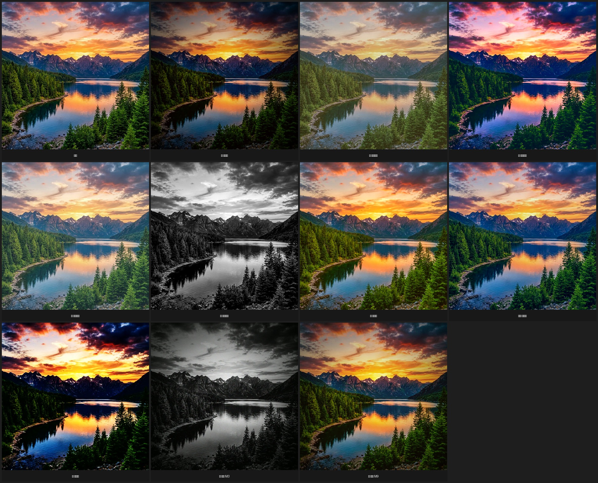

# x-tools 视频处理工具箱

一个简单易用的批处理工具箱，专注于视频修复与增强。

**核心功能**: 去水印 (OpenCV/LaMA 深度学习)、高清重置 (Real-ESRGAN/FFmpeg)、帧数补充 (RIFE)、格式转换 (FFmpeg)。

## 🚀 快速开始 (30秒上手)

**1. 安装 FFmpeg**

| 平台 | 命令 |
|------|------|
| macOS | `brew install ffmpeg` |
| Ubuntu | `sudo apt install ffmpeg` |
| Windows | `winget install Gyan.FFmpeg` (安装后需**重启终端**) |

**2. 环境配置**

**macOS / Linux:**
```bash
python3 -m venv .venv
source .venv/bin/activate
pip install -r requirements.txt
```

**Windows (PowerShell):**
```powershell
python -m venv .venv
& .\.venv\Scripts\Activate.ps1
pip install -r requirements.txt
```

> ⚠️ **Windows 注意**: 请使用 `python` 而非 `python3`，激活虚拟环境时必须使用 `& .\.venv\Scripts\Activate.ps1` 语法。
> 若安装 FFmpeg 后仍提示未检测到，请重启终端或执行:
> ```powershell
> $env:Path = [System.Environment]::GetEnvironmentVariable("Path","Machine") + ";" + [System.Environment]::GetEnvironmentVariable("Path","User")
> ```

**3. 运行交互式终端**
无需记忆命令，通过箭头键选择功能：

```bash
python main.py
```

支持：
- 📂 **输入源灵活**: 自动扫描 `input/` 目录，或选择单个文件/任意文件夹。
- 💧 **去水印**: 支持鼠标框选区域 (OpenCV 快速修复 / LaMA 深度学习无痕修复)。
- 🏷️ **加水印**: 文字水印 (支持中文) / 图片水印 (Logo), 支持图片和视频。
- 🆙 **高清重置**: 批量 2x/4x 放大 (使用 Real-ESRGAN AI 或 FFmpeg)。
- 🔄 **格式转换**: 视频格式互转 / 提取音频 / 去除音频 / 快速无损封装。
- 📊 **查看信息**: 显示分辨率、清晰度等级、帧率、编码器、码率、音频等详细信息。
- ✅ **自动质量检测**: 黑场 / 静音 / 冻结检测 + 元信息诊断, 生成报告。
- 🎨 **滤镜效果**: 10 种热门预设 (电影感/复古/赛博朋克/日系/黑白/暖色/冷色/高对比/徕卡M3/徕卡M9)。

  <details><summary>📸 点击查看滤镜效果预览</summary>

  

  </details>

- ✂️ **裁切比例**: 居中裁切为 1:1 / 3:4 / 4:3 / 9:16 / 16:9 等比例。
- 🎬 **拼接视频**: 多视频拼接, 支持过渡效果与音频平滑。
- 🎵 **添加背景音乐**: 为单个视频添加 BGM, 支持音量调节与混音。
- 📝 **字幕**: AI 语音识别自动生成字幕 (Whisper), 字幕烧录, 一键字幕。

---

## 🗂️ 目录结构
```
x-tools/
├── main.py                       # 🚀 交互式入口
├── config.py                     # ⚙️ 全局配置
├── input/                        # 📂 默认输入目录
├── output/                       # 📂 默认输出目录
└── tools/
    ├── watermark/                # 去水印模块 (OpenCV, LaMA)
    ├── add_watermark/            # 加水印模块 (文字, Logo)
    ├── upscale/                  # 超分模块 (Real-ESRGAN, FFmpeg)
    ├── interpolation/            # 插帧模块 (RIFE, FFmpeg)
    ├── convert/                  # 格式转换模块 (FFmpeg)
    ├── filter/                   # 滤镜效果 (FFmpeg)
    ├── crop/                     # 裁切比例 (FFmpeg)
    ├── concat/                   # 视频拼接 (FFmpeg)
    ├── bgm/                      # 添加背景音乐 (FFmpeg)
    ├── ffmpeg/                   # FFmpeg 共享构建逻辑
    ├── qc/                       # 自动质量检测 (FFmpeg)
    ├── subtitle/                 # 字幕 (Whisper + FFmpeg)
    └── mediainfo/                # 媒体信息查看 (FFprobe)
```

```
music/                            # 背景音乐目录 (放入 .mp3/.wav 等音频文件)
```

## 📦 依赖说明
- **基础依赖**: `opencv-python`, `ffmpeg-python`, `rich`, `InquirerPy`, `Pillow`
- **AI 增强 (按需安装)**:
  - 去水印 (LaMA): `torch`, `torchvision` (首次运行自动下载模型)
  - 超分 (Real-ESRGAN): `basicsr`, `realesrgan`
  - 插帧 (RIFE): `rife-ncnn-vulkan-python`
  - 字幕 (Whisper): `openai-whisper`
